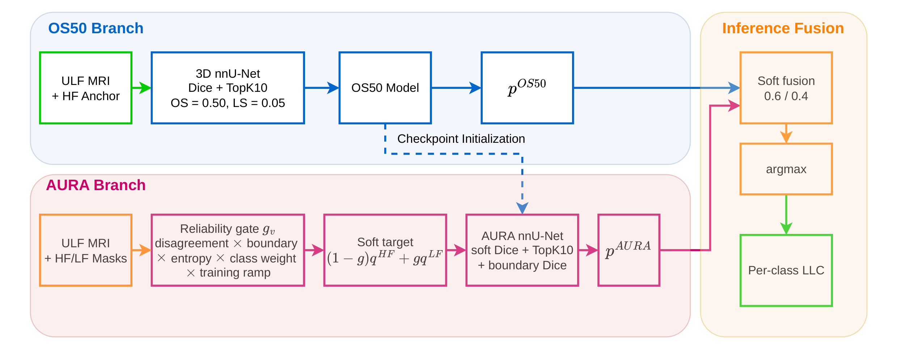

<div align="center">

# AURA

**Asymmetric Paired-Annotation Learning for Multi-Structure ULF Pediatric Brain MRI Segmentation**

Official code for the LISA 2026 Challenge Task 2 report.

[](https://github.com/MIC-DKFZ/nnUNet)
[](https://huggingface.co/hieuphamha/A-nnU-Net-based-asymmetric-supervision-strategy)
[](LICENSE)

</div>

## Overview

LISA provides two annotations for each ultra-low-field (ULF) MRI: an HF-derived
mask used for scoring and an LF-edited mask aligned with visible ULF anatomy.
AURA keeps HF as the training anchor and introduces LF through a bounded
reliability gate based on disagreement, boundaries, uncertainty, class, and
training stage.

AURA changes supervision only. Inference requires a ULF volume and uses no HF
image or annotation. The submitted system combines:

- **OS50:** HF-supervised nnU-Net anchor.
- **AURA:** OS50-initialized model fine-tuned with asymmetric HF/LF supervision.
- **Fusion:** `0.6 * p(OS50) + 0.4 * p(AURA)`, argmax, then per-label largest
  connected component.

<div align="center">

</div>

Method details and hyperparameters are in [`docs/METHOD.md`](docs/METHOD.md).

## Results

Fold-0 development results: 16 cases, 11 foreground labels, evaluated against
the HF reference.

| Method | DSC ↑ | HD ↓ | HD95 ↓ | ASSD ↓ | RVE (→0) |
| :-- | --: | --: | --: | --: | --: |
| OS50 | 0.7984 | 3.5245 | **1.8822** | 0.7873 | −0.0109 |
| AURA | 0.7950 | 3.5902 | 1.9041 | 0.7988 | **0.0036** |
| **OS50 + AURA** | **0.7988** | **3.5243** | 1.8892 | **0.7855** | −0.0093 |

Official Task 2 validation leaderboard: **DSC 0.82 / HD 3.41**.

The ensemble weight was selected on the same development split, and its DSC
gain over OS50 is small (+0.0004). Per-case and per-label results are available
in [`results/`](results/) and [`docs/RESULTS.md`](docs/RESULTS.md).

## Installation

```bash
git clone https://github.com/minhdang050806/A-nnU-Net-based-asymmetric-supervision-strategy.git
cd A-nnU-Net-based-asymmetric-supervision-strategy

python -m venv .venv
source .venv/bin/activate
pip install -r requirements.txt
python scripts/install_extensions.py
python scripts/install_extensions.py --check
```

Set the standard nnU-Net paths before training or evaluation:

```bash
export nnUNet_raw=/path/to/nnUNet_raw
export nnUNet_preprocessed=/path/to/nnUNet_preprocessed
export nnUNet_results=/path/to/nnUNet_results
```

Dataset preparation and reproduction commands are documented in
[`docs/REPRODUCE.md`](docs/REPRODUCE.md).

## Model weights and inference

Download both fold-0 checkpoints and their nnU-Net metadata from
[Hugging Face](https://huggingface.co/hieuphamha/A-nnU-Net-based-asymmetric-supervision-strategy):

```bash
hf download hieuphamha/A-nnU-Net-based-asymmetric-supervision-strategy \
  --local-dir aura-models
mkdir -p docker/models
cp -a aura-models/models/. docker/models/
```

| Branch | Dataset | Trainer | Best epoch |
| --- | --- | --- | ---: |
| OS50 | `Dataset001_LISA` | `nnUNetTrainerDiceTopK10_OS50_LS005` | 896 |
| AURA | `Dataset002_LISA_VCF` | `nnUNetTrainerAURA_v0` | 458 |

Run the challenge-style Docker inference pipeline:

```bash
git clone https://github.com/MIC-DKFZ/nnUNet.git docker/nnUNet
python scripts/install_extensions.py --nnunet-dir docker/nnUNet
cd docker
sha256sum -c SHA256SUMS
./build.sh lisa-os50-aura:local
./test.sh lisa-os50-aura:local /absolute/path/to/input /absolute/path/to/output
```

The container accepts `.nii.gz`, `_ciso.nii.gz`, or `_0000.nii.gz` ULF volumes
and writes `<case>_seg_prediction.nii.gz`. See [`docker/README.md`](docker/README.md)
or the Hugging Face model card for complete build and inference instructions.

The released AURA weight is the surviving epoch-458 packaged checkpoint
(cross-evaluation DSC 0.7961). The intermediate checkpoint behind the paper's
standalone DSC 0.7950 was overwritten; details are recorded in
[`results/metrics/aura_packaged_checkpoint_all11.json`](results/metrics/aura_packaged_checkpoint_all11.json).

## Repository structure

```text
nnunet_extensions/  AURA loss and custom nnU-Net trainers
scripts/             dataset preparation, evaluation, fusion, and figures
docker/              challenge inference container
docs/                method, reproduction, and results documentation
paper/               report source and figures
results/             metrics, split, plans, and training logs
```

## Data

LISA 2026 data is not redistributed. Obtain it from the challenge organizers.
The exact 5-fold split is provided in [`results/splits/splits_final.json`](results/splits/splits_final.json).

## Citation

```bibtex
@inproceedings{pham2026aura,
  title     = {Asymmetric Paired-Annotation Learning for Multi-Structure
               {ULF} Pediatric Brain {MRI} Segmentation},
  author    = {Pham, Ha-Hieu and Cao, Dang P. M. and Pham, Minh Hoang and
               Vo Ngoc, Khanh Nguyen and Nguyen, Thanh-Huy and
               Bagci, Ulas and Pham, Huy-Hieu},
  booktitle = {MICCAI Challenge on Low-field pediatric brain magnetic resonance
               Image Segmentation and quality Assurance (LISA)},
  year      = {2026}
}
```

## License

Apache License 2.0. See [LICENSE](LICENSE). Challenge data remains subject to
the LISA 2026 data use agreement.
